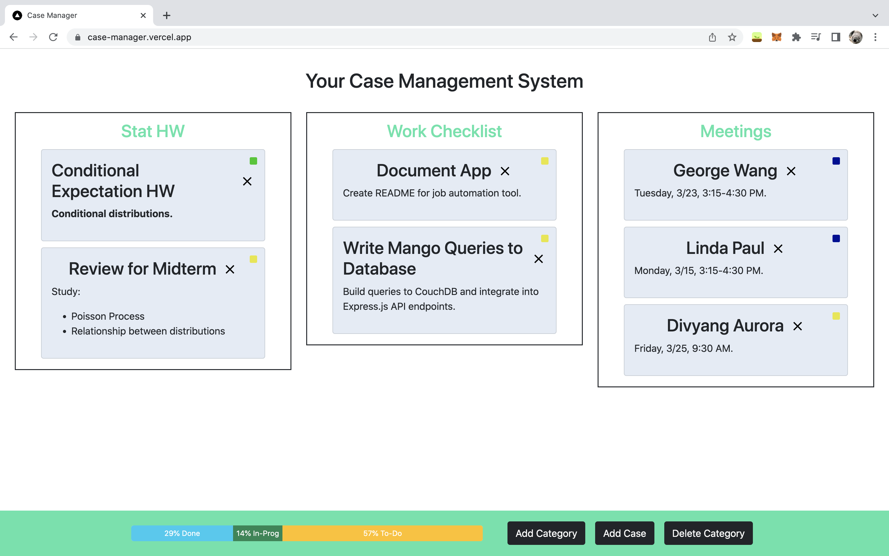
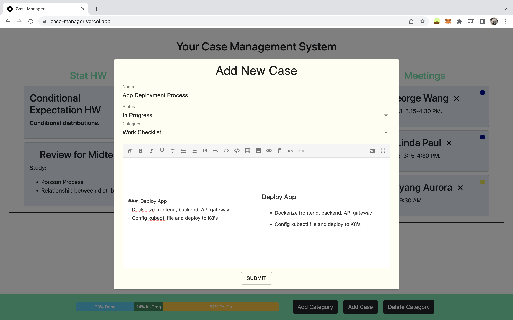

# Case Management Application

Built with TypeScript, Next.js, React. Hasura GraphQL backend. 

- Add/delete categories and cases. 
- Status icons (to-do, in progress, complete).
- Progress bar and custom footer.
- Markdown formatting of each case
- Responsive design

## Interface

## New Case

